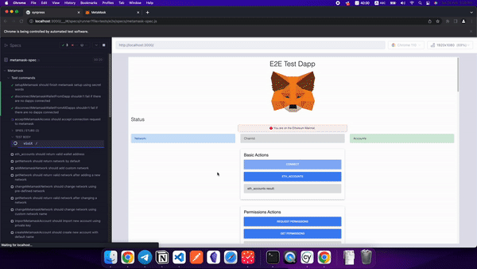

[](https://badge.fury.io/js/%40synthetixio%2Fsynpress)

[](https://github.com/Synthetixio/synpress/actions/workflows/codeql.yml)
[](https://github.com/Synthetixio/synpress/actions/workflows/release.yml)
[](https://dashboard.cypress.io/projects/ohpeaz/runs)
[](https://discord.gg/XhZKSRGtWc)
[](https://twitter.com/synpress_)

> **We're Hiring 🎉** — Think you have what it takes? We're looking for Software
> Engineer,
> [find out more](https://mirror.xyz/synpress.eth/FXhd5-7e7wBmYYtfmqkF0h7FhDBRUGuGF6j-D7jPpvM).

#

<p align="center" >
  
  <p align="center">
    <a href="https://github.com/Synthetixio/synpress">Synpress</a> 
    is E2E testing framework <br/> based on <a href="https://www.cypress.io/">Cypress</a>
    and <a href="https://playwright.dev/">Playwright</a> 
    with support for <a href="https://metamask.io/">MetaMask</a>.
  </p>
</p>

<p align="center">
    <i>Sponsored & used by: </i> <br/> <br/>
    <a href="https://github.com/Synthetixio"></a>
    <a href="https://github.com/ethereum-optimism"></a>
</p>

<p align="center">
    <i>Power users:</i> <br/> </br>
    <a href="https://github.com/phantom"></a>
    <a href="https://github.com/ensdomains"></a>
    <a href="https://github.com/Kwenta"></a>
    <br/>
    <a href="https://github.com/pantherprotocol"></a>
    <a href="https://github.com/agoraxyz"></a>
    <a href="https://github.com/aragon"></a>
    <a href="https://github.com/delvtech/"></a>
    <br/>
    <a href="https://github.com/OffchainLabs"></a>
    <a href="https://github.com/snapshot-labs"></a>
    <a href="https://github.com/hashgraph"></a>
  </p>
</p>

#

<p align="center">
  
</p>

Synpress makes sure to always use latest version of metamask and puts a lot of
effort to make sure that dapp tests are stable and trustful.

It also provides an easy way to use and access metamask straight from your e2e
tests with all features of cypress and playwright.

🔥 Synpress works out-of-the-box with other frameworks! There is no need to use
it directly. Check
[usage examples](https://github.com/Synthetixio/synpress/#usage-examples) for
more details.

# Table of content

- [](#)
- [](#-1)
- [Table of content](#table-of-content)
  - [🧑‍🤝‍🧑 Community](#-community)
  - [🖥️ Install](#️-install)
  - [⚙️ Supported frameworks](#️-supported-frameworks)
  - [👝 Supported wallets](#-supported-wallets)
  - [✍️ Usage examples:](#️-usage-examples)
  - [🌟 Features](#-features)
  - [👷 Example setup for eslint and tsconfig](#-example-setup-for-eslint-and-tsconfig)
  - [⚡ Important notes](#-important-notes)
  - [🐳 Using with Docker](#-using-with-docker)
    - [Requirements](#requirements)
    - [Some neat features](#some-neat-features)
    - [How to run e2e tests for Synpress using Docker](#how-to-run-e2e-tests-for-synpress-using-docker)
  - [💁‍♂️ CI tips \& tricks](#️-ci-tips--tricks)
  - [🧪 Usage \& commands](#-usage--commands)
  - [📃 Environmental variables](#-environmental-variables)
  - [🚢 Release process](#-release-process)
  - [📝 More resources](#-more-resources)

## 🧑‍🤝‍🧑 Community

- [Discord](https://discord.gg/XhZKSRGtWc) => for **live support** and direct
  chat with devs.
- [Twitter](https://twitter.com/synpress_) => for updates and announcements.

## 🖥️ Install

```bash
# with pnpm
pnpm add --save-dev @synthetixio/synpress
# with npm
npm install --save-dev @synthetixio/synpress
# with yarn
yarn add -D @synthetixio/synpress
```

## ⚙️ Supported frameworks

- [Synpress](https://github.com/Synthetixio/synpress)
- [Playwright](https://playwright.dev/) (as a plugin)
- [Cypress](https://github.com/cypress-io/cypress) (as a plugin)

## 👝 Supported wallets

- [MetaMask](https://metamask.io/)

## ✍️ Usage examples:

- [⭐ Synpress examples](https://github.com/drptbl/synpress-examples/)
- [Synpress e2e tests](https://github.com/Synthetixio/synpress/tree/dev/tests/e2e)

---

For full Synpress commands and their examples,
[check here](https://github.com/Synthetixio/synpress/blob/dev/docs/synpress-commands.md).

To see in which direction Synpress is headed to, take a look at
[planning board](https://github.com/orgs/Synthetixio/projects/14).

## 🌟 Features

- Added support for metamask 🦊
- Supports headless mode 🤖 (`synpress run --headless`)
  - Recommended for local development (but
    [not for CI yet](https://developer.chrome.com/articles/new-headless/) as
    it's new and experimental)
- Integrated with
  [Docker 🐳](https://github.com/Synthetixio/synpress#-using-with-docker)
  - Recommended for
    [CI](https://github.com/Synthetixio/synpress#ci-tips--tricks)
  - Includes VNC and [noVNC](https://novnc.com/info.html)
  - Integrated video recording 🎥 (full screen)
  - Exposes noVNC with [ngrok](https://ngrok.com/) (optional)
- Easy to debug 🐛
  - Improved error handling
  - Supports [cypress](https://docs.cypress.io/guides/guides/debugging) and
    [playwright](https://playwright.dev/docs/debug) debuggers
  - noVNC allows for interactions through browser 🌐
  - Debug remote machines on CI with ngrok
- Blazingly-fast ⚡
- Extensible ⚙️ (add own custom commands and plugins)
- Can be used in existing
  [Cypress setup](https://github.com/Synthetixio/synpress/issues/346#issuecomment-1060506096)
- Supports dotenv
  - Loads all env vars from your `.env` file automatically (from project root
    folder)
- Ability to use latest metamask or lock it's version to avoid unexpected
  failures related to metamask updates
- Supports multi-lang of metamask, it doesn't depend on any labels
- Synpress is
  [fully tested](https://github.com/Synthetixio/synpress/tree/dev/tests/e2e/specs)
- Waits for XHR requests, navigations and animations automatically
- Ability to fail test run if there are any browser console errors found
- Types support for all additional custom commands
- The best possible options set up in place to avoid flakiness
- Etherscan API helpers in place which for ex. allows to compare your
  transaction results with etherscan and check tx status
- Synthetix helpers in place which allows to interact with synthetix protocol
  programmatically
- Supports codespaces
  - Run your tests in docker
  - Get your feedback remotely thanks to ngrok
  - Use mpeg-4 preview plugin to watch videos from inside codespaces :) ...

## 👷 Example setup for eslint and tsconfig

Project structure:

```text
project_dir
└── src
└── tests
    └── e2e
        └── .eslintrc.js
        └── support.js
        └── tsconfig.json
        └── specs
            └── example-spec.js
        └── pages
            └── example-page.js
```

1. Create `.eslintrc.js` inside your tests folder (`/project_dir/tests/e2e`):

```js
const path = require('path');
const synpressPath = path.join(
  process.cwd(),
  '/node_modules/@synthetixio/synpress',
);

module.exports = {
  extends: `${synpressPath}/.eslintrc.js`,
};
```

2. Create `support.js` inside your tests folder (`/project_dir/tests/e2e`):

```js
import '@synthetixio/synpress/support/index';
```

_^ hint: you can also use this file to extend synpress - add custom commands,
and more.._

3. Create `tsconfig.json` inside your tests folder (`/project_dir/tests/e2e`):

```json
{
  "compilerOptions": {
    "allowJs": true,
    "baseUrl": "../../node_modules",
    "types": [
      "cypress",
      "@synthetixio/synpress/support",
      "cypress-wait-until",
      "@testing-library/cypress"
    ],
    "outDir": "./output"
  },
  "include": ["**/*.*"]
}
```

4. You're done! 🎉

To change specific values in default config, you can use `--config` flag. For
example, to change path for `support.js` file, you can use
`synpress run --config "supportFile=__tests__/e2e/supportFile.js"`

If you would like to use custom paths for your tests and configs, you should
[mirror (full) default synpress config](https://github.com/Synthetixio/synpress/blob/dev/synpress.config.js)
and then modify it for your needs. Then you can direct synpress to use it with
`--configFile` flag.

For example: `synpress run --configFile __tests__/e2e/customConfig.config.js`

## ⚡ Important notes

Synpress doesn't seem to communicate with metamask properly if
`"chromeWebSecurity": false` flag is set. More about it
[here](https://github.com/Synthetixio/synpress/issues/17).

Thanks to
[new headless mode in Chrome](https://developer.chrome.com/articles/new-headless/),
tests are now working in headless mode 🤖 (`synpress run --headless`). However,
I recommend to use it only for local development as this feature is new and
experimental and may cause issues on CI (UNIX). So please, stick to non-headless
mode on CI.

In the past, tests worked only in non-headless mode because extensions were not
supported in headless mode by
[playwright](https://playwright.dev/docs/chrome-extensions) and
[Cypress](https://docs.cypress.io/api/plugins/browser-launch-api.html#Add-browser-extensions).
As a workaround, we've provided Docker 🐳 containers. They solved this issue and
it's an alternative.

You have to setup `xvfb` and window manager (like `fluxbox` or `xfce4`) to run
tests without issues on CI (together with `DISPLAY` env var). Take a look at
[CI tips & tricks](https://github.com/Synthetixio/synpress/tree/dev/.github/workflows)
for working examples.

There is a global
[`before()`](https://github.com/synthetixio/synpress/blob/dev/support/index.js#L27)
which runs metamask setup before all tests:

- passes welcome page
- imports wallet
- changes network (defaults to `goerli`) or creates custom network and changes
  to it (depending on your setup)
- switches back to Cypress window and starts testing

It requires environmental variable called `SECRET_WORDS` to be present in
following format => `'word1 word2 word3 ..'` (delimited with spaces) or private
key in an environmental variable called `PRIVATE_KEY`.

To change default network (`goerli`), you can use `NETWORK_NAME` environmental
variable, for example: `NETWORK_NAME=sepolia`.

Available choices are: `mainnet`, `goerli`, `sepolia` and `localhost`.

To create and switch to custom network at metamask setup phase, use these:

1. `NETWORK_NAME` => ex: `synthetix`
2. `RPC_URL` => ex: `https://synthetix-node.io`
3. `CHAIN_ID` => ex: `123`
4. `SYMBOL` => ex: `SNX`
5. `BLOCK_EXPLORER` (optional) => ex: `https://synthetix-explorer.io`
6. `IS_TESTNET` (optional) => ex: `false`

Metamask version is hardcoded and frequently updated under supervision to avoid
a case when e2e tests break because of CSS classes changes in new version, so
all you need is to keep synpress updated in your project. However, you can still
override metamask with `METAMASK_VERSION` environmental variable, for example:
`METAMASK_VERSION=10.21.0` or `METAMASK_VERSION=latest`.

If you don't want to use environmental variables, you can modify
[`setupMetamask()`](https://github.com/synthetixio/synpress/blob/dev/support/index.js#L29)
to following:

`setupMetamask(secretWordsOrPrivateKey, network, password)`, for example:
`setupMetamask('word1 word2 word3 ..', 'mainnet', 'password')` (delimited with
spaces).

You can also add and switch to custom network by passing an `object` instead of
`string` inside `setupMetamask(secretWordsOrPrivateKey, network, password)`
function for `network` parameter.

If you want to use Etherscan API helpers, you will have to provide Etherscan API
key using `ETHERSCAN_KEY` environmental variable.

To fail a test if there are any browser console errors, set `FAIL_ON_ERROR` to
`1` or `true`.

Automatic waiting for XHR requests to finish before tests start can be turned on
with `CYPRESS_RESOURCES_WAIT` environmental variable, set it to `1` or `true`.

If you want to skip metamask extension installation or metamask setup, you can
use `SKIP_METAMASK_INSTALL` and `SKIP_METAMASK_SETUP` separately. Both variables
accept `1` or `true`.

Synpress is blazingly-fast ⚡ by default! If you want to change that, you can
use `STABLE_MODE=true` (which will introduce delays only between main actions,
300ms by default) / `STABLE_MODE=<value>` or `SLOW_MODE=true` (which will
introduce delay between every action, 50ms by default) / `SLOW_MODE=<value>`.

`DEBUG=synpress:*` is very useful while debugging your tests. It enables
following features:

- improved logging
- [Cypress debugger](https://docs.cypress.io/guides/guides/debugging)
- [Playwright debugger](https://playwright.dev/docs/debug)
- slow down tests

You may encounter 403 errors (on shared IPs & CI) related to rate limiting while
fetching metamask releases from GitHub REST API. This should never happen at
all, but it's good to mention. To prevent it from happening, you can create new
private access token on GitHub (without any additional access) and specify
`GH_USERNAME` & `GH_PAT` environmental variables.

## 🐳 Using with Docker

Docker is awesome for CI. Give it a try.

### Requirements

- [docker](https://www.docker.com/)
- [docker-compose](https://docs.docker.com/compose/install/)

### Some neat features

- based on [docker-e2e](https://github.com/Synthetixio/docker-e2e) ❤
- full screen video recording 🎥 (together with metamask extension)
- VNC & noVNC support 🖥️ (very easy to debug with browser)
  - local: http://localhost:8080/vnc.html?autoconnect=true
- ngrok 🔌 integration (exposes noVNC for everyone)
  - remote: https://<random>.ngrok.io/vnc.html?autoconnect=true (check logs for
    url)

### How to run e2e tests for Synpress using Docker

1. `git clone git@github.com:Synthetixio/synpress.git`
2. `cd synpress`
3. (optional) Fill env vars inside `.env` file
4. (with foundry; preferred)
   `docker-compose --profile synpress --profile foundry up --build --exit-code-from synpress`
   or `./start-tests.sh`
   - (without foundry)
     `docker-compose up --profile synpress --build --exit-code-from synpress`
5. (with foundry and ngrok)
   `docker-compose --profile synpress --profile foundry --profile ngrok up --build --exit-code-from synpress`

All examples of setup are present in this repository. Just take a look around.

## 💁‍♂️ CI tips & tricks

- Check out many different examples for GitHub Actions
  [in this repository](https://github.com/Synthetixio/synpress/tree/dev/.github/workflows):
  - [e2e_headful.yml](https://github.com/Synthetixio/synpress/blob/dev/.github/workflows/e2e_headful.yml)
    => runs on `ubuntu-latest`.
  - [e2e_debug.yml](https://github.com/Synthetixio/synpress/blob/dev/.github/workflows/e2e_debug.yml)
    => runs on `ubuntu-latest`, has configured VNC, noVNC and ngrok for easy
    debugging.
  - [e2e_docker.yml](https://github.com/Synthetixio/synpress/blob/dev/.github/workflows/e2e_docker.yml)
    => runs on `ubuntu-latest` with `docker compose` stack.
  - [e2e_cypress-action.yml](https://github.com/Synthetixio/synpress/blob/dev/.github/workflows/e2e_cypress-action.yml)
    => runs on `ubuntu-latest`, using official
    [cypress-io/github-action](https://github.com/cypress-io/github-action).
- You can find examples for GitLab CI =>
  [here](https://gitlab.com/synpress/synpress-demo#synpress-gitlab-demo).
- Use [docker-e2e](https://github.com/Synthetixio/docker-e2e)
- Synpress is tested and should work on all resolutions, starting from 800x600

## 🧪 Usage & commands

- `synpress run` to run tests
- `synpress open` to open Cypress UI (may be bugged in some cases because it
  doesn't clear metamask state before each e2e test, please use `synpress run`)

Command line interface (`synpress help`):

```text
Usage: synpress run [options]

launch tests

Options:
  -b, --browser <name>               run on specified browser (default: "chrome")
  -c, --config <config>              set configuration values, separate multiple values with a comma
  -cf, --configFile <path>          specify a path to *.js file where configuration values are set
  -e, --env <env=val>                set environment variables, separate multiple values with comma
  -s, --spec <path or glob>          run only provided spec files
  -ne, --noExit                     keep runner open after tests finish
  -pr, --project <path>              run with specific project path
  -q, --quiet                        only test runner output in console
  -r, --reporter <reporter>          specify mocha reporter
  -ro, --reporterOptions <options>  specify mocha reporter options, separate multiple values with comma
  -r, --record                       [dashboard] record video of tests running after setting up your project to record
  -k, --key <key>                    [dashboard] set record key
  -p, --parallel                     [dashboard] run recorded specs in parallel across multiple machines
  -g, --group [name]                 [dashboard] group recorded tests together under a single run
  -t, --tag <name>                   [dashboard] add tags to dashboard for test run
  -h, --help                         display help for command
```

```text
Usage: synpress open [options]

launch test runner UI

Options:
  -cf, --configFile <path>  specify a path to *.js file where configuration values are set
  -h, --help                display help for command
```

## 📃 Environmental variables

| Variable                | Description                                                                                                                                                                                                 |
| ----------------------- | ----------------------------------------------------------------------------------------------------------------------------------------------------------------------------------------------------------- |
| `SECRET_WORDS`          | Space separated words for the test wallet recovery phrase (mnemonic; 12 words)                                                                                                                              |
| `PRIVATE_KEY`           | Test wallet private key                                                                                                                                                                                     |
| `NETWORK_NAME`          | Network name (eg `NETWORK_NAME=Optimism`)                                                                                                                                                                   |
| `RPC_URL`               | Network RPC (eg`RPC_URL=https://mainnet.optimism.io`)                                                                                                                                                       |
| `CHAIN_ID`              | Network ID (eg`CHAIN_ID=10`)                                                                                                                                                                                |
| `SYMBOL`                | Native chain token ticker (eg `SYMBOL=OP`)                                                                                                                                                                  |
| `IS_TESTNET`            | `boolean` indicates that the added network is testnet                                                                                                                                                       |
| `BLOCK_EXPLORER`        | Blockchain explorer (eg `BLOCK_EXPLORER=https://optimistic.etherscan.io/`)                                                                                                                                  |
| `SYNDEBUG`              | Set debugging mode to be on                                                                                                                                                                                 |
| `STABLE_MODE`           | Introduce delay between main actions, 300ms by default (eg `STABLE_MODE=300ms`, `STABLE_MODE=true`)                                                                                                         |
| `SLOW_MODE`             | Introduce delay between every action, 50ms by default (eg `SLOW_MODE=true`, `SLOW_MODE=200ms`)                                                                                                              |
| `METAMASK_VERSION`      | Metamask version to be installed                                                                                                                                                                            |
| `SKIP_METAMASK_INSTALL` | Will skip MetaMask installation                                                                                                                                                                             |
| `SKIP_METAMASK_SETUP`   | Will skip MetaMask initial setup                                                                                                                                                                            |
| `GH_USERNAME`           | GitHub username (used to avoid rate-limit issues while downloading Metamask)                                                                                                                                |
| `GH_PAT`                | GitHub [personal access token](https://docs.github.com/en/authentication/keeping-your-account-and-data-secure/creating-a-personal-access-token) (used to avoid rate-limit issue while downloading metamask) |
| `ETHERSCAN_KEY`         | [Etherscan key](https://info.etherscan.com/etherscan-developer-api-key/) (used only for etherscan-related commands)                                                                                         |
| `FAIL_ON_ERROR`         | Fail a test if there are any browser console errors                                                                                                                                                         |
| `CYPRESS_GROUP`         | [Group tests](https://docs.cypress.io/guides/guides/command-line#cypress-run-group-lt-name-gt)                                                                                                              |
| `CI`                    | Boolean value indicates that tests are running from CI/CD pipeline                                                                                                                                          |

## 🚢 Release process

1. Create PR from `dev` branch to `master` branch
2. Merge it (new `-beta` version is automatically released)
3. Run GitHub Action workflow named
   [Release CI](https://github.com/Synthetixio/synpress/actions/workflows/release.yml)
   with `patch|minor|major` depending on your needs to promote your build.

Alternatively, instead of running GitHub Action for release, you can move on
with manual release process:

1. Switch to `master` branch and pull latest changes
2. Run `pnpm release:patch/minor/major` command
3. Keep `dev` branch up to date with `master`

Above actions will lead to:

- New npm node module release
- New GitHub packages node module release
- New GitHub release (tagged) created with changelog from commit messages

## 📝 More resources

- [End-to-end testing using Synpress](https://klaytn.foundation/synpress-setup-tutorial/)
- [Synpress - web3-enabled e2e testing tool](https://gitcoin.co/grants/5699/synpress-web3-enabled-e2e-testing-tool)
- [How to set up Synpress for Web3 dApp Frontend Test Automation with MetaMask](https://medium.com/andamp/how-to-setup-synpress-for-wen3-dapp-frontend-test-automation-with-metamask-73396896684a)
- [Extending Synpress with additional MetaMask commands](https://medium.com/andamp/extending-synpress-with-additional-metamask-commands-fdc6b35a2ffc)
- [Test e2e login to dApp with Metamask with Synpress](https://medium.com/coinmonks/test-e2e-login-to-dapp-with-metamask-with-synpress-5248dd1f17c1)
